# 🛰️ Kafka Dual-Consumer Playground

A **pet project** for experimenting with Apache Kafka, focused on how two
independent consumers can **share or duplicate work** depending on their
configuration.

The repo spins up three moving parts:

| Component | What it does | Source entry-point |
|-----------|--------------|--------------------|
| **Producer** | Generates fake payment transactions and pushes them to Kafka at a fixed interval (default = 2 s). | `src/main.py start-producer` |
| **Consumer BRAVO** | Reads the topic in batches, processes each batch with a configurable pipeline. | `src/main.py start-consumer --client bravo` |
| **Consumer ZULU** | Same codebase, different `client_id` (`zulu`). | `src/main.py start-consumer --client zulu` |

Running `make play` launches **all three** in one terminal; hit **Ctrl +C** to
shut everything down in one go.

```bash
❯ make play
echo "Starting producer and consumer. Ctrl+C to stop both."
trap 'echo "\n🛑 Stopping producer and consumer…"; kill 0' SIGINT
uv run --directory src -m main start-producer &
uv run --directory src -m main start-consumer &
wait
Starting producer and consumer. Ctrl+C to stop both.
[client 🟣 BRAVO] Starting consumer loop. Control+c to cancel the loop
[client 🔵 ZULU] Starting consumer loop. Control+c to cancel the loop
Starting producer loop (interval: 2s)... Control+c to cancel the loop
✅ Sent transaction: 97912285-f411-4e2d-b4c7-35b4c4692f67
✅ Sent transaction: 57f6e3f6-d076-4e70-8dd8-19dadfb839dd
✅ Sent transaction: 91114403-79a5-452f-a04f-8e40b1527183
[client 🔵 ZULU] Received batch of 3 transactions
[client 🟣 BRAVO] Received batch of 3 transactions
✅ Sent transaction: 50f33e76-a15c-4e7d-b6df-731353590d44
✅ Sent transaction: f1844b22-486b-49d4-b7ca-8858963ba938
[client 🟣 BRAVO] Received batch of 1 transactions
[client 🔵 ZULU] Received batch of 1 transactions
✅ Sent transaction: 018f2e70-7423-48ca-bdc0-fab2e02b09ba
[client 🟣 BRAVO] Received batch of 2 transactions
[client 🔵 ZULU] Received batch of 2 transactions
✅ Sent transaction: bf7bd9be-351d-4add-bcbb-9688e3459618
[client 🔵 ZULU] Received batch of 1 transactions
✅ Sent transaction: b84593f5-5ee8-4bf9-8107-b43413652983
[client 🟣 BRAVO] Received batch of 2 transactions
✅ Sent transaction: f0d7672c-54f3-4b67-a2a9-523ac5c12728
[client 🔵 ZULU] Received batch of 2 transactions
^C\n🛑 Stopping producer and consumer…
```


## Why two consumers?

| Scenario | `group_id` used | Result |
|----------|-----------------|--------|
| **Work-sharing / load-balancing** | Both consumers use **the same** `group_id`. | Kafka assigns each partition to **one** consumer, so the work is split. |
| **Work duplication / fan-out** | Each consumer has **its own** `group_id`. | Both read **all** partitions, useful for side-effects, auditing, etc. |

For tinkering we default to **distinct groups**: `test_group_zulu` and
`test_group_bravo`, so you can see both clients handle every message.

```mermaid
flowchart LR
    %% ──────── Topic with three partitions ────────
    subgraph TOPIC["Kafka Topic (3 partitions)"]
        direction LR
        P0["Partition 0"]
        P1["Partition 1"]
        P2["Partition 2"]
    end

    %% ──────── Producer ────────
    Producer((Producer))
    Producer --> P0
    Producer --> P1
    Producer --> P2

    %% ──────── Consumer ZULU (own group) ────────
    subgraph GROUP_ZULU["Consumer Group · test_group_zulu"]
        direction TB
        C1Z["Consumer ZULU"]
    end
    P0 --> C1Z
    P1 --> C1Z
    P2 --> C1Z

    %% ──────── Consumer BRAVO (own group) ────────
    subgraph GROUP_BRAVO["Consumer Group · test_group_bravo"]
        direction TB
        C1B["Consumer BRAVO"]
    end
    P0 --> C1B
    P1 --> C1B
    P2 --> C1B
```




---

## Project goals

* Practice the **Kafka client API** (poll loop, manual commits, batching).
* See how **partitions × (consumer groups)** shape the flow of messages.
* Compare *size-based* vs *time-based* batching:
```python
    # inside KafkaConsumerRepository.get_batch()
    if len(buffer) >= SIZE or elapsed >= MAX_WAIT_S:
        commit() ; 
        return buffer
```

## Quick start
### Prerequisites

- Docker + Docker Compose (for the Kafka single-node cluster)
- Python 3.11+
- uv (ultra-fast package runner)
- make

### Configure
- Create your .env file in the root of the project with:
```bash
KAFKA_HOST_IP=10.1.1.16
```

### Provision topics
- make provision

### Run
- make play
